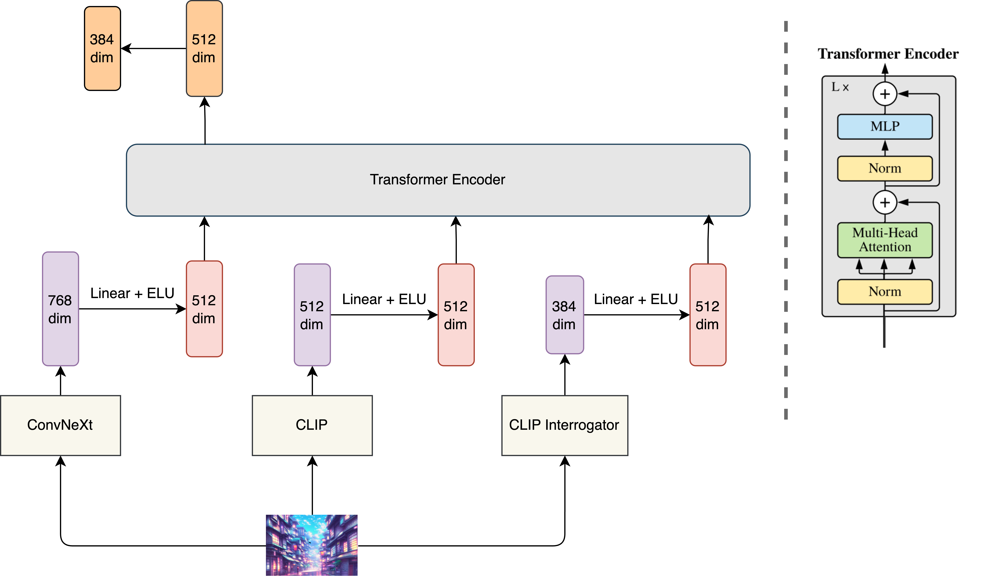

# Image-to-Prompts

## CSE 252D Advanced Computer Vision Mini Project
### Team Members: Sai Sree Harsha, Rohit Ramaprasad, Omkar Bhope, Yejin Jeon

Text-to-image generative models represent a powerful and innovative approach for creating visual artwork. The rising popularity of these models has given rise to the new field of prompt engineering. While there has been significant progress in prompt engineering for text generation purposes, less work has been done to rigorously examine how users can prompt generative frameworks with natural language for visual generation purposes. 

In this project, we propose a novel Transformer based ensemble model for the task of predicting the text prompt given a generated image. The predicted text prompt can then be edited and used to generate new images similar to the existing one. Our proposed ensemble model uses embeddings derived from several models such as ConvNext, CLIP and BLIP, and leverages the attention mechanism to fuse these embeddings using a transformer encoder model. We train and evaluate our proposed transformer ensemble model using a large dataset of (prompt, image) pairs from DiffusionDB, and show that our model is able to generate text prompts similar to the prompts used to generate the image.



## Demo
The Jupyter notebook demonstrating our proposed model pipeline including embedding generation and inference of our Transformer ensemble model can be found at [demo_notebook.ipynb](https://github.com/Gateway2745/Image-to-Prompts/blob/main/demo_notebook.ipynb).

Please make sure that you have downloaded the our Transformer ensemble model weights before attempting to run the demo. Links to the weights can be found in the [Evaluation and Checkpoints](#evaluation-and-checkpoints) section below.

## Requirements
We used Google Colaboratory for all tasks in our project including data-processing and training. Install the following additional requirements on top of the default environment provided by Google Colab.

```
!pip install sentence_transformers
!pip install ftfy regex tqdm
!pip install git+https://github.com/openai/CLIP.git
!pip install pytorch_lightning torchmetrics
!pip install clip-interrogator==0.6.0
```

## Data

### Downloading Raw Data (Not recommended)
We use a set of 93000 (image, prompt) pairs from the [Diffusion DB dataset](https://huggingface.co/datasets/poloclub/diffusiondb). You can download the first 100 parts and unzip the data as described [here](https://huggingface.co/datasets/poloclub/diffusiondb#downloading-a-range-of-files).

Then you can use the following commands to generate the embeddings required by our ensemble model, including the ground truth prompt embeddings, CLIP model embeddings, ConvNext model embeddings and the CLIP Interrogator embeddings.
```
python gt_prompt_embedding_creation.py
python clip_embedding_creation.py
python convnext_embedding_creation.py
python clip_intgtr_embedding_creation.py
```
### Downloading Pre-computed Embeddings
We have precomputed the embeddings required to train and evaluate our model. You can find all the four embeddings (ground truth prompt embeddings, CLIP model embeddings, ConvNext model embeddings and the CLIP Interrogator embeddings) for the 3 datasets through the Google Drive links in the Table below.

|10k dataset|43k dataset|93k dataset|
|:---:|:---:|:---:|
|[10K_embeddings](https://drive.google.com/drive/folders/10sjzdXXAhJ3vjF1fh5j9c4lleInqmTkK?usp=share_link)|[50K_embeddings](https://drive.google.com/drive/folders/11B6GNBh2Bz7Duo3R2Pr0KVLcCkJFl16o?usp=share_link)| [100K_embeddings](https://drive.google.com/drive/folders/1sgTM3q27sFcXRzfY259NMaJaIvo-kIGu?usp=share_link)|

## Training
Please see the config files [config-10k.yml](https://github.com/Gateway2745/Image-to-Prompts/blob/main/config-10k.yml), [config-50k.yml](https://github.com/Gateway2745/Image-to-Prompts/blob/main/config-50k.yml), [config-100k.yml](https://github.com/Gateway2745/Image-to-Prompts/blob/main/config-100k.yml) for settings hyperparameters and paths to data files.

The command for training is,
```
python train.py config-10k.yml
```

## Evaluation and Checkpoints

The average cosine similarity of our ensemble models on the validation sets of our 10k, 43k and 93k datasets is shown below. The model checkpoints for our Transformer Ensemble Model are also linked below.

||10k dataset|43k dataset|93k dataset|
|:---:|:---:|:---:|:---:|
|**Average cosine similarity**|0.701|0.687|0.690|
|**Model checkpoint**|[10K_ensemble_model.ckpt](https://drive.google.com/file/d/1A_Ue5li4f9cY5wiB3GgFe1F_VD-rk-K7/view?usp=share_link)|[50K_ensemble_model.ckpt](https://drive.google.com/file/d/1aiV5W01t_L4x4nTVROoEX8muabwMwOfq/view?usp=share_link)| [100K_ensemble_model.ckpt](https://drive.google.com/file/d/1jwkhx6Vwyuj4S_EnggBtKbVIY7LSLS_T/view?usp=share_link)|
